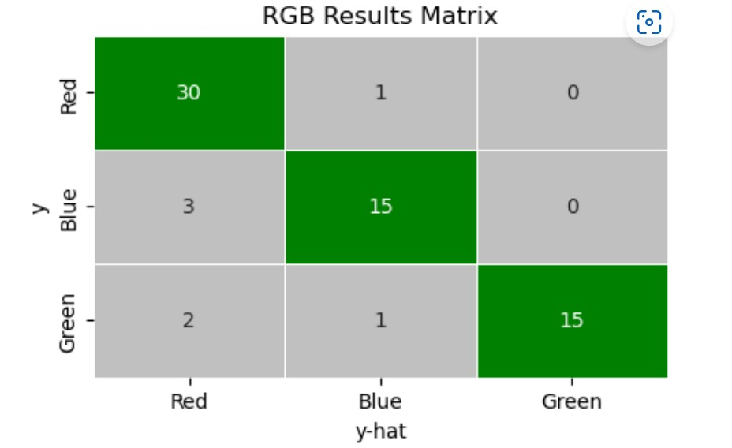

# Creating a "Seaborn Confusion Matrix"

## Overview
When testing classification models I frequently require a confusion matrix. Seaborn, being my go to for visual analysis, does not have an out of the box confusion matrix visualization. This short project illustrates how to create a wrapper to provide this functionality when testing classification predictive results. The code will be stored as a function in a module for ease of reuse.

## Data
The data used is a mock-up of results from an RGB classification model. The use-case is there is a target called colour and the three classifications of colour are Red, Green, and Blue. 

## Visualization
The visualization returned from the function will be a confusion matrix with defaults that look like the following illustration:  

## Technologies Used
*  [scikit-learn](https://scikit-learn.org/stable/index.html)
*  [matlotlib](https://matplotlib.org/)
*  [Seaborn](https://seaborn.pydata.org/)

## Walk-through  
[![Confusion Matrix Wrapper Function]
(https://img.youtube.com/vi/9z9cbMsyn50/maxresdefault.jpg)]
(https://www.youtube.com/watch?v=9z9cbMsyn50)

## Installation and Usage
The function requires that the matplotlib,  seaborn, and scikit-learn (sklearn) modules be installed. Both of these libraries are imported into the module.
